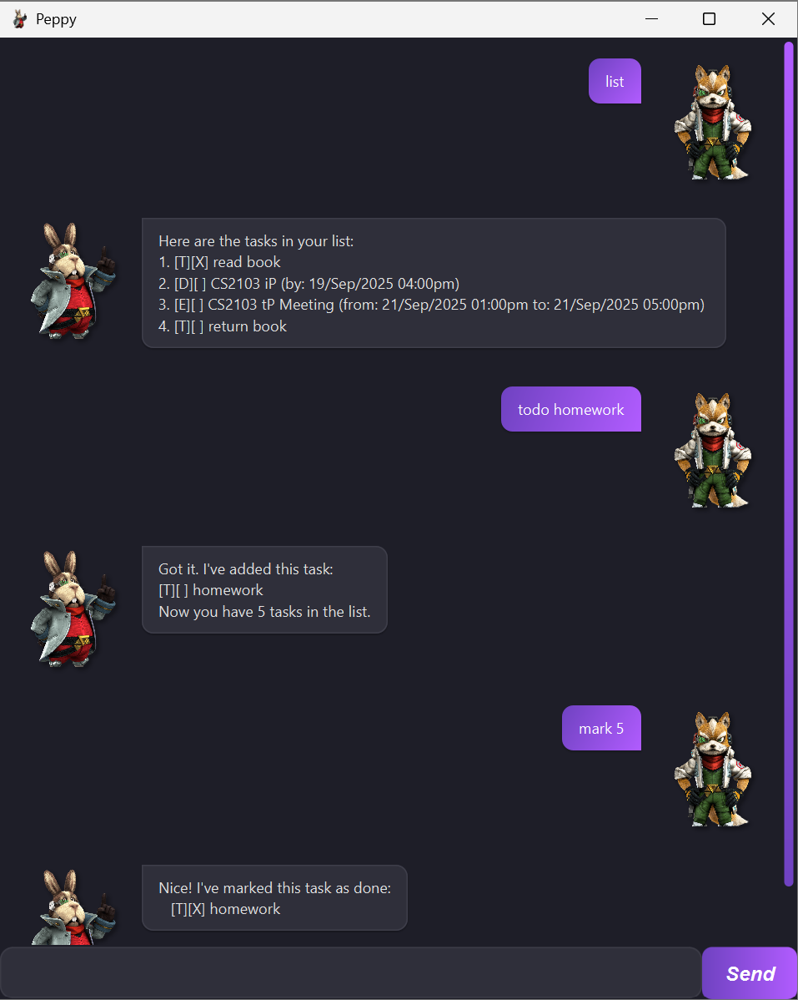
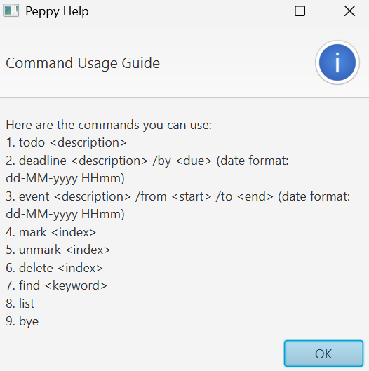
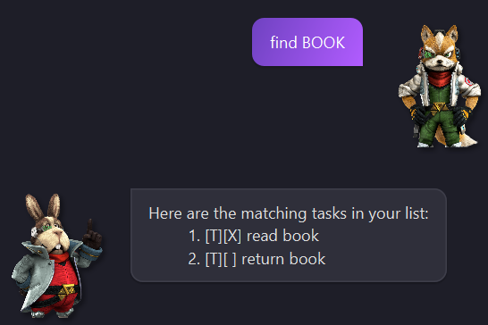

# Peppy User Guide

Peppy is a chatbot that helps **track your task that YOU need to do!**

##### Table of Contents
- [Quick start](#quick-start)  
- [Feature](#features)  
  - [Viewing help: `help`](#viewing-help-help)
  - [Adding todo: `todo`](#adding-todo-todo)
  - [Adding deadline: `deadline`](#adding-deadline-deadline)
  - [Adding event: `event`](#adding-event-event)
  - [Marking tasks: `mark`](#marking-tasks-mark)
  - [Unmarking tasks: `unmark`](#unmarking-tasks-unmark)
  - [Deleting tasks: `delete`](#deleting-tasks-delete)
  - [Finding tasks: `find`](#finding-tasks-find)
  - [Listing all tasks: `list`](#listing-all-tasks-list)
  - [Exiting the program: `bye`](#exiting-the-program-bye)

## Quick Start
1. Ensure you have Java `17` or above installed on your computer.  
2. Download the latest `jar` file from [here](https://github.com/jxnwxx/ip/releases).
3. Copy the file to the folder you wish to use as the _home folder_.
4. Open a command terminal, `cd` into the _home folder_, and use `java -jar peppy.jar` command to run the application.
5. Type the command in the chat box and press Enter to execute. e.g. type `help` and pressing Enter will open the 
   help window.
6. Refer to [Features](#Features) below for details of each command.

## Features
### Viewing help: `help`
Shows a pop-up message box with the various usable commands.

Format: `help`

### Adding todo: `todo`
Adds a todo task to the task list.

Format: `todo <description>`

Examples:
- `todo read book`
- `todo Homework`

### Adding deadline: `deadline`
Adds a deadline task to the task list.

Format: `deadline <description> /by <due_date>`
> [!NOTE]
> All dates are in dd-MM-yyyy HHmm. e.g. 25-12-2025 2359

Examples:
- `deadline CS2103T iP /by 19-09-2025 2359`
- `deadline return book /by 21-09-2025 1200`

### Adding event: `event`
Adds an event task to the task list.

Format: `event <description> /from <start_date> /to <end_date>`

Examples:
- `event CS2103T Project Meeting /from 20-09-2025 1300 /to 20-09-2025 1600`
- `event book club reading /from 19-09-2025 1500 /to 19-09-2025 1700`

### Marking tasks: `mark`
Marks a task as done.

Format: `mark <index>`

Examples:
- `mark 1` Marks task on index 1 in the task list as done.

### Unmarking tasks: `unmark`
Marks a task as not done.

Format: `unmark <index>`

Examples:
- `unmark 2` Marks task on index 2 in the task list as not done.

### Deleting tasks: `delete`
Deletes a task from the task list.

Format: `delete <index>`

Examples:
- `delete 3` Deletes task on index 3 in the task list.

### Finding tasks: `find`
Finds tasks whose description contains the given keywords.

Format: `find <keyword>`
- Search is case-insensitive. e.g. `book` will match `Book`
- Spaces are included in search. e.g. `read book` will only match any task with `read book` in its description.

Example:
- `find read book` returns `read book`
- `find book` returns `read book` and `return book`

### Listing all tasks: `list`
Shows a list of all tasks in the task list.

Format: `list`

### Exiting the program: `bye`
Exits the program.

Format: `exit`
